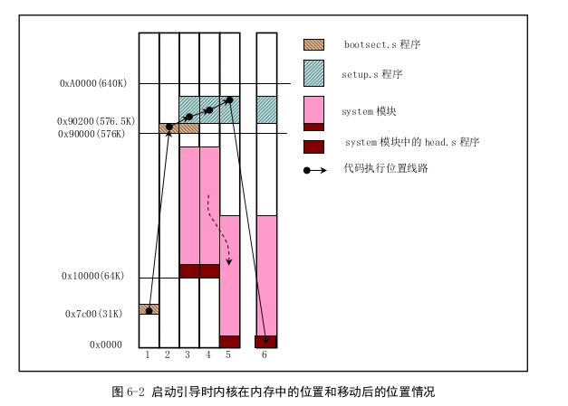

## 实验内容

阅读《Linux 内核完全注释》的第 6 章，对计算机和 Linux 0.11 的引导过程进行初步的了解；
按照下面的要求改写 0.11 的引导程序 bootsect.s
有兴趣同学可以做做进入保护模式前的设置程序 setup.s。

改写 bootsect.s 主要完成如下功能：
- [x] bootsect.s 能在屏幕上打印一段提示信息“XXX is booting...”，其中 XXX 是你给自己的操作系统起的名字，例如 LZJos、Sunix 等（可以上论坛上秀秀谁的 OS 名字最帅，也可以显示一个特色 logo，以表示自己操作系统的与众不同。）

改写 setup.s 主要完成如下功能：
- [x] bootsect.s 能完成 setup.s 的载入，并跳转到 setup.s 开始地址执行。而 setup.s 向屏幕输出一行"Now we are in SETUP"。
- [x] setup.s 能获取至少一个基本的硬件参数（如内存参数、显卡参数、硬盘参数等），将其存放在内存的特定地址，并输出到屏幕上。
- [x] setup.s 不再加载 Linux 内核，保持上述信息显示在屏幕上即可。

## 基础知识
bootsect.s 和 setup.s 是实模式下允许的 16 位程序，采用 Intel 汇编语言语法，并且使用 Intel 8086 汇编编译器和连接器 as86和ld86
head.s 使用 GNU 的汇编程序格式，并且运行在保护模式下，需要使用 GNU 的as进行编译。
### 总体功能
这里说明一下80x86架构下linux系统的启动流程，整体流程我们可以看以下截图

磁盘上代码分布入下

#### BISO 
1. 接通电源后，CPU进入实模式，并从地址 0xFFFF0 处开始自动执行程序代码，这个地址通常是ROM-BIOS中的地址
2. BIOS 执行检测
3. 在物理地址0处初始化中断向量
4. 将可启动设备的第一个扇区（磁盘引导扇区，512字节）读入内存绝对地址 0x7C00 处
##### bootsect.s
1. bootsect.s 是linux最前面的部分，执行时把自己移动到内存绝对地址 0x90000 处
2. 把启动设备中后 2KB 字节代码（setup.s）移动到 0x90200 处
3. 利用 BIOS 中断 0x13 读取磁盘参数表中当前启动引导盘的参数
4. 在屏幕显示 "Loading System..."
5. 把内核的 system 模块读入到内存 0x10000(64KB) 处
6. 确定根文件系统的设备号，保存其设备号于 root_dev(引导块的508地址)
7. 跳转到 setup 程序开始处(0x90200) 执行 setup 程序
##### setup.s
1. 利用 BIOS 中断读取机器系统数据，并把这些数据保存到 0x90000 开始的位置
2. 把 system 模块移动到物理内存起始 0x00000处，这样system模块中代码的地址也即等于实际的物理地址，便于对内核代码和数据进行操作。
3. 加载中断描述符表寄存器 idtr 和全局描述符表寄存器 gdtr
4。 开启 A20 地址线，重新设置中断控制芯片，
5。 设置 CPU 的控制寄存器 CR0， 从而进入保护模式运行，并跳转到 head.s 程序继续运行
#### head.s
1. 加载各个数据段寄存器，重新设置中断描述符表 idt
2. 重新设置 gdt 表
3. 设置管理内存的分页处理机制
4. 运行 main 程序