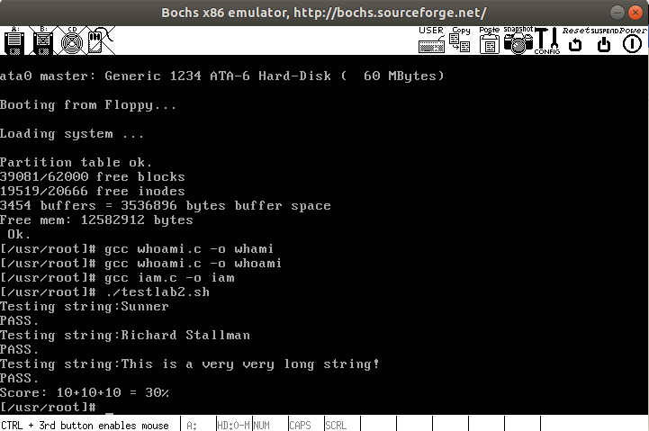
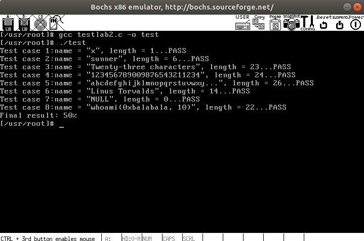

## 实验内容
此次实验的基本内容是：在 Linux 0.11 上添加两个系统调用，并编写两个简单的应用程序测试它们。

（1）iam()
第一个系统调用是 iam()，其原型为：
```c
int iam(const char * name);
```
完成的功能是将字符串参数 name 的内容拷贝到内核中保存下来。要求 name 的长度不能超过 23 个字符。返回值是拷贝的字符数。如果 name 的字符个数超过了 23，则返回 “-1”，并置 errno 为 EINVAL。在 `kernal/who.c` 中实现此系统调用。

（2）whoami()
第二个系统调用是 whoami()，其原型为：
```c
int whoami(char* name, unsigned int size);
```
它将内核中由 iam() 保存的名字拷贝到 name 指向的用户地址空间中，同时确保不会对 name 越界访存（name 的大小由 size 说明）。返回值是拷贝的字符数。如果 size 小于需要的空间，则返回“-1”，并置 errno 为 EINVAL。也是在 `kernal/who.c` 中实现。


```c
// user mode
int main() {
	whoami();
}

// kernal mode
whoami() {
	printk(100, 8);
}
```

## 实验结果



## 实验步骤
调用自定义函数是通过 call 指令直接跳转到该函数的地址，继续运行,而调用系统调用，是调用系统库中为该系统调用编写的一个接口函数，叫 API（Application Programming Interface）。API 并不能完成系统调用的真正功能，它要做的是去调用真正的系统调用，过程是：
- 把系统调用的编号存入 EAX；
- 把函数参数存入其它通用寄存器；
- 触发 0x80 号中断（int 0x80）。

Linux 0.11添加一个系统调用foo()的步骤：
1. 在 `linux/include/linux/sys.h` 中加入`sys_foo()` 函数的函数名，即入口地址，在该头文件中声明sys_foo()函数
2. 在 `linux/include/unistd.h` 中定义 `sys_foo()` 函数的系统调用号，同时修改 `nr_system_calls` 的值
3. 在内核中实现真正的系统调用函数 `sys_foo()`
4. 修改对应的 `linux/kernel/Makefile` 文件
5. 编写API函数 `foo()`，根据其参数个数调用 `syscall0` 到 `syscall3` 这4个宏函数的其中一个，或者手动添加含有`int $0x80`的嵌入汇编代码，通过 `EAX` 寄存器传入系统调用号，进入内核


### 1. 修改 unistd.h
在 `linux/inculde/unistd.h` 中添加对应的宏
```c
#define __NR_iam	72
#define __NR_whoami	73
```

### 2. 修改sys.h
在 `linux/include/linux/sys.h` 中添加对应的函数定义，注意要和上述的宏的顺序保持一致
```c
extern int sys_iam();
extern int sys_whoami();


fn_ptr sys_call_table[] = { ..., sys_iam, sys_whoami };
```

### 3. 创建文件
创建 `kernal/who.c` 并且添加两个系统调用接口。
#### 用户态和内核态之间的数据传递
要实现上述功能，主要靠以下两个内核函数来完成：
- put_fs_byte()：核心态—>用户态，把内核态一个字节的数据var拷贝到由 `fs:addr` 指向的用户态内存地址空间。
- get_fs_byte()：用户态—>核心态，把用户态地址 `fs:addr` 中的数据拷贝到内核中
该系列函数在 `/linux/include/asm/segment.h` 中

```c
#include <linux/kernel.h>
#include <asm/segment.h>
#include <errno.h>

#define NAMELEN 23
char username[NAMELEN + 1];

/*
 * 完成的功能是将字符串参数 name 的内容拷贝到内核中保存下来，即将用户态的数据保存到内核中
 * 
 * 要求 name 的长度不能超过 23 个字符。返回值是拷贝的字符数。
 * 如果 name 的字符个数超过了 23，则返回 “-1”，并置 errno 为 EINVAL。
 */
int sys_iam(const char * name) {
	int namelen = 0;
	while (get_fs_byte(name + namelen) != '\0') {
		namelen++;
	}
	if (namelen <= NAMELEN) {
		printk("iam start to copy, name: %s, namelen: %d\n", name, namelen);
		int i;
		for (i = 0; i < namelen; i++) {
			username[i] = get_fs_byte(name + i);
		}
		username[i] = '\0';
		printk("iam success, username: %s, res: %d\n", username, namelen);
		return namelen;
	} else {
		printk("iam error, the username's length is %d longer than 23!\n", namelen);
		return -(EINVAL);
	}
}

/*
 * 它将内核中由 iam() 保存的名字拷贝到 name 指向的用户地址空间中，
 * 同时确保不会对 name 越界访存（name 的大小由 size 说明）。
 * 即将内核中的数据拷贝到用户态中
 * 
 * 返回值是拷贝的字符数。如果 size 小于需要的空间，则返回“-1”，并置 errno 为 EINVAL
 */
int sys_whoami(char* name, unsigned int size) {
	unsigned int namelen = 0;
	int i;
	int res = 0;
	while (username[namelen] != '\0') {
		namelen++;
	}
	if (namelen > size) {
		printk("whoami error, the namelen %d is longer than size %d\n", namelen, size);
		res = -(EINVAL);
	} else {
		for (i = 0; i < namelen; i++) {
			put_fs_byte(username[i], name + i);
		}
		put_fs_byte('\0', name + i);
		res = namelen;
		printk("whoami success, str: %s, namelen: %d\n", username, namelen);
	}
	return res;
}

```

### 4. 修改Makefile
由于文件是创建在 kernel 下，因此我们需要修改该目录下的 Makefile，有两处需要修改
```c
// 新增依赖
OBJS  = ... who.o

// 新增对应编译命令
### Dependencies:
who.s who.o: who.c ../include/linux/kernel.h ../include/unistd.h
```

### 5. 编写测试代码
由于所使用的gcc 是 1.4版本的，因此采用的是C89标准，该标准规定变量的定义只能在程序的开头，或者说定义变量的前面不能有其他非声明或非定义的语句.注意，连注释都不能有。
```c
#define __LIBRARY__
#include <unistd.h>
#include <stdio.h>

_syscall1(int, iam, const char*, name)

#define NAMELEN 100
char name[NAMELEN];

int main(int argc, char *argv[]) {
	int nameLen = 0;
	int result;

	printf("hello test iam\n");
	if (argc >= 2) {
		while ((name[nameLen] = argv[1][nameLen]) != '\0') {
			nameLen++;
		}
		printf("str: %s, len: %d\n", name, nameLen);
		result = iam(name);
		printf("res = %d\n", result);
	} else {
		printf("number of parameter less than 1\n");
	}
	return 0;
}
```
```c
#define __LIBRARY__
#include <stdio.h>
#include <unistd.h>
#include <errno.h>


_syscall2(int, whoami, char*, name, unsigned int, size)

#define SIZE 23

int main(void) {
	char name[SIZE + 1];
	int res;
	printf("hello test whoami\n");
	res = whoami(name, SIZE + 1);
	if (res == -1) {
		errno = EINVAL;
	} else {
		printf("name: %s, res: %d\n", name, res);
	}
	return res;
}

```